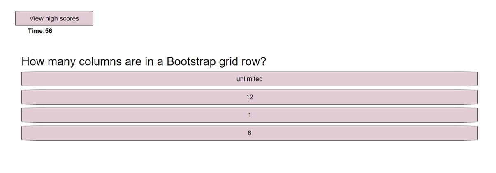

# Coding Quiz

## Description
This application allows a user to test their coding knowledge with a quiz that will save the user's initials and scores. It was created using HTML5, CSS, JavaScript, jQuery, Bootstrap.

## GitHub
Here is the [GitHub repo](https://github.com/Abi-Queen/Coding-Quiz). 

## Contributors
This project was created by [Abigail Queen](https://github.com/Abi-Queen) with help from bootcamp tutors Mansi Patel, Matthew Lemke, and bootcamp TAs.

Other resources utilized:
- [UC Davis Coding Bootcamp 2022](https://bootcamp.ucdavis.edu/), Modules 4-5
- [Walter Nascimento, "Creating a timer with JavaScript" in Dev.to](https://dev.to/walternascimentobarroso/creating-a-timer-with-javascript-8b7)
- [W3C Schools](https://www.w3schools.com/) 

## Date
September 2022